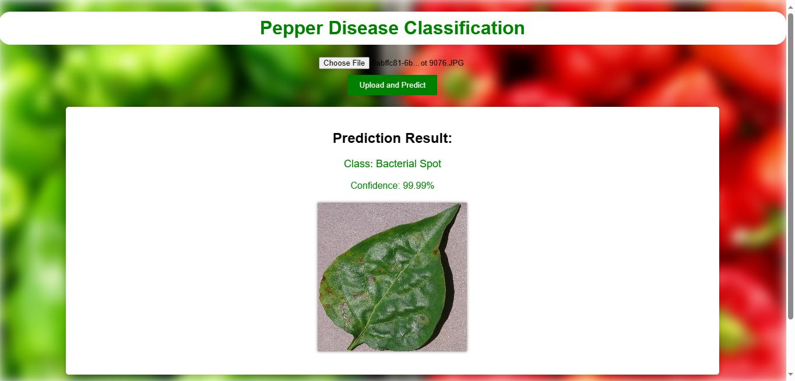

# Bell Pepper Bacterial Infection Detection Model

Welcome to the Bell Pepper Bacterial Infection Detection project! This project utilizes a TensorFlow model trained on a Kaggle dataset to classify images of bell peppers as either having a bacterial infection or being healthy. The project consists of a FastAPI backend for serving the model and a simple HTML, CSS, and JavaScript frontend for user interaction.



## Table of Contents
- [Introduction](#introduction)
- [Requirements](#requirements)
- [Installation](#installation)
- [Usage](#usage)
- [Project Structure](#project-structure)
- [Contributing](#contributing)
- [License](#license)

## Introduction
This project aims to provide a user-friendly interface for detecting bacterial infections in bell peppers using a pre-trained TensorFlow model. Users can upload images of bell peppers, and the model will predict whether the peppers are healthy or infected.

## Requirements
Before running the project, ensure that you have the following prerequisites installed:

- Python (3.6+)
- TensorFlow
- FastAPI
- HTML, CSS, and JavaScript-enabled web browser

You can find the specific Python dependencies in the `api/requirements.txt` file.

## Installation
Follow these steps to set up and run the Bell Pepper Bacterial Infection Detection project:

1. Clone the repository to your local machine using the following command:
  ```bash
  git clone git@github.com:DavidCarG/BellPepperDisease.git
  ```
2. Install the Python dependencies by running the following command:
  ```bash
  pip install -r api/requirements.txt
  ```
## Usage
To use the Bell Pepper Bacterial Infection Detection project, follow these steps:

1. Start the FastAPI server by running the main.py file

2. Open your web browser and navigate to frontend/index.html. This will load the user interface for uploading images and receiving predictions.

3. Upload an image of a bell pepper using the provided interface, and the model will predict whether it is healthy or infected with bacteria.

4. View the prediction results on the web interface.

## Project Structure

The project is organized into the following directories:

- api/: Contains the FastAPI backend code, including the pre-trained TensorFlow model and API routes.
- frontend/: Contains the HTML, CSS, and JavaScript files for the user interface.
- model/: Includes the pre-trained TensorFlow model and associated files.
